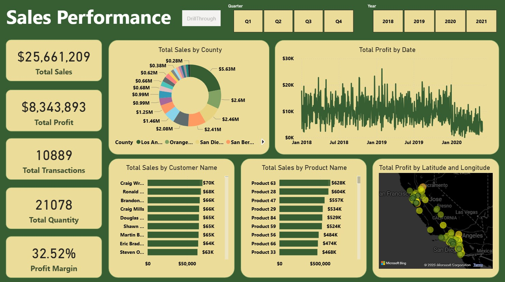
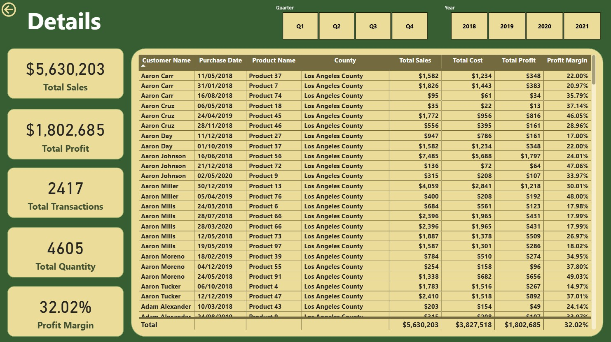

# 📈 Sales-Performance Dashboard

## 📚 About Data
This comprehensive sales dashboard presents key financial metrics including total sales, profits, transactions, and profit margin, with detailed breakdowns by county, customer, and product. It features interactive time filters for quarterly and yearly analysis, alongside geographic profit visualization to identify regional performance patterns.

## 💡 Highlights

- Total sales reached over $25.6 million with a strong profit margin of 32.52%.
- Total profit stands at $8.34 million from 10,889 transactions, reflecting healthy business performance.
- Sales are distributed across multiple counties, with Los Angeles County contributing the highest revenue ($5.63M).
- Top customers and products are identified, with the highest product sales exceeding $600K.
- Profit trends over time and geographic profit distribution highlight seasonal and regional performance variations.

## ✏️ Data Wrangling
Conducted simple data wrangling and data cleaning:

- Removed rows with missing values
- Cleaned Valuation and Funding columns and cast as float
- Exclude rows with "Unknown" Funding values
- Explode Select Investors column into individual rows for categorical analysis

## 📊 Visualization
- Produced a 2-pager dashboard using Power BI.
- Power BI : [Link](https://app.powerbi.com/view?r=eyJrIjoiYWNlMmU1MjUtMjM2NC00ZWUxLThjYWEtOTBkOTY4YmU5NGY1IiwidCI6ImFjZWQ1ODNlLTRhM2ItNDJkZS05ZTQ0LTRlNWFmYTk5Yjk4YSIsImMiOjEwfQ%3D%3D)

